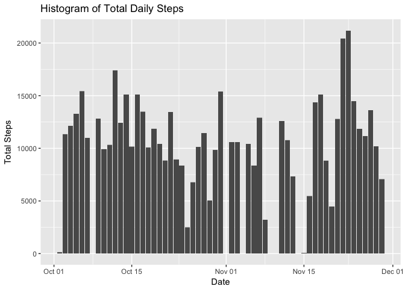
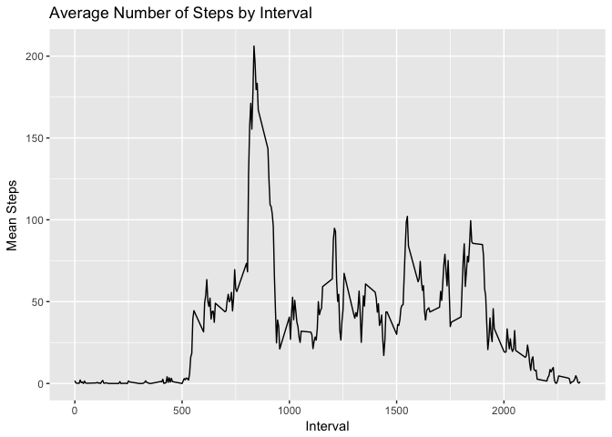
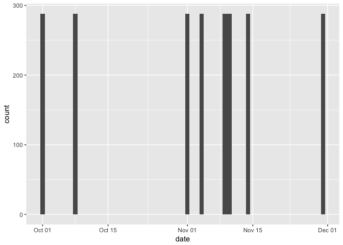
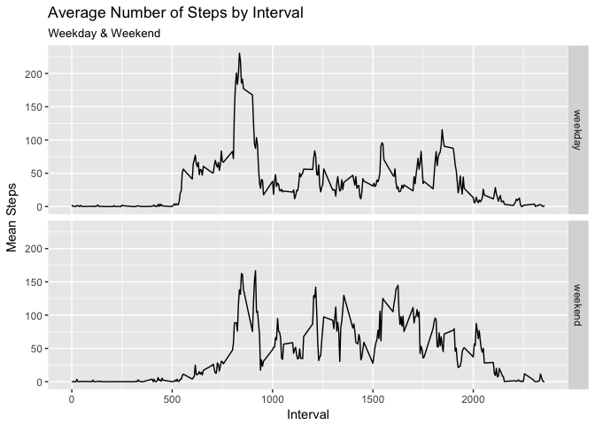

#### Load & Preprocess Data
Clear the active workspace and then load the libraries required.

```r
rm(list=ls())

libraries <- c("data.table", "tidyverse", "lubridate")
lapply(libraries, require, character.only = T)
```

```
## Loading required package: data.table
```

```
## Loading required package: tidyverse
```

```
## ── Attaching packages ──────────────────────────────────────────────────────── tidyverse 1.2.1 ──
```

```
## ✔ ggplot2 2.2.1     ✔ purrr   0.2.4
## ✔ tibble  1.4.1     ✔ dplyr   0.7.4
## ✔ tidyr   0.7.2     ✔ stringr 1.2.0
## ✔ readr   1.1.1     ✔ forcats 0.3.0
```

```
## ── Conflicts ─────────────────────────────────────────────────────────── tidyverse_conflicts() ──
## ✖ dplyr::between()   masks data.table::between()
## ✖ dplyr::filter()    masks stats::filter()
## ✖ dplyr::first()     masks data.table::first()
## ✖ dplyr::lag()       masks stats::lag()
## ✖ dplyr::last()      masks data.table::last()
## ✖ purrr::transpose() masks data.table::transpose()
```

```
## Loading required package: lubridate
```

```
## 
## Attaching package: 'lubridate'
```

```
## The following objects are masked from 'package:data.table':
## 
##     hour, isoweek, mday, minute, month, quarter, second, wday,
##     week, yday, year
```

```
## The following object is masked from 'package:base':
## 
##     date
```

```
## [[1]]
## [1] TRUE
## 
## [[2]]
## [1] TRUE
## 
## [[3]]
## [1] TRUE
```

```r
rm(libraries)
```

Once in the active directory with the .csv present, we may load the data:


```r
data <- fread("./activity.csv")
```

Before we can analyze we'll do some basic transformations, by setting the `date` variable to the appropriate type


```r
data[, date := ymd(date)]
```

## Mean Total Number of Steps per Day

#### Histogram of Daily Total Steps
Here's a histogram of total daily steps


```r
ggplot(data, aes(date, steps)) + geom_histogram(stat = "identity") +
        labs(title = "Histogram of Total Daily Steps",
             x = "Date",
             y = "Total Steps")
```

```
## Warning: Ignoring unknown parameters: binwidth, bins, pad
```

```
## Warning: Removed 2304 rows containing missing values (position_stack).
```

<!-- -->

#### Daily Mean & Median Total Steps

Here's the mean total steps per day


```r
data[, .(total_steps = sum(steps, na.rm = T)), by = .(date)][, mean(total_steps)]
```

```
## [1] 9354.23
```

And the median total steps per day


```r
data[, .(total_steps = sum(steps, na.rm = T)), by = .(date)][, median(total_steps)]
```

```
## [1] 10395
```

## Average Daily Activity Patterns

To look at the average daily activity patterns, we'll first calculate the averages for each interval as its own data table. 

For clarity, the interval is the time of day and we're looking at the average number of steps for that time across the dataset (excluding missing data), which is **61 days**.  


```r
data_interval <- data[, .(mean_steps = mean(steps, na.rm = T)), by = .(interval)]
```

#### Time-Series of Intervals

With this transformed data table, we can now plot a time-series to see the average number of steps for the intervals


```r
ggplot(data_interval, aes(interval, mean_steps)) + geom_line() +
        labs(title = "Average Number of Steps by Interval",
             x = "Interval",
             y = "Mean Steps")
```

<!-- -->

#### Maximum Interval

From the same data table we can determine which interval on average contains the maximum number of steps (most movement) and what the maximum is


```r
data_interval[mean_steps == max(mean_steps)]
```

```
##    interval mean_steps
## 1:      835   206.1698
```

## Imputing Missing Values

#### Number of Missing Values

We can see the number of missing values (of the `steps` variable), and as a proportion of the dataset


```r
nrow(data[is.na(steps)])
```

```
## [1] 2304
```

```r
nrow(data[is.na(steps)])/nrow(data)
```

```
## [1] 0.1311475
```

#### Strategy for Imputing

Let's first look at where the missing values occur to decide on a simple but bias-limited strategy for imputing the missing values.

We already know that the missing values make up about 13.1% of the dataset, which is useful.  Further, a simple plot will help further to see if the missing data is random or has any pattern to it.  We'll create the plot from the missing values subset


```r
data_missing <- data[is.na(steps)]

ggplot(data_missing, aes(date)) + geom_bar()
```

<!-- -->

With the bars all being at the maximal height (288 intervals per day) we can conclude that missing values are for entire days rather than for partial days and so imputing daily averages are impossible, so we'll opt for interval averages.

#### New Dataset with Filled In Data

To accomplish this we'll utilize the same data table from our time-series, `data_interval`, and fill in the appropriate mean where we encounter missing values.  Specifically, we'll merge the mean steps by interval to the dataset and then transform -- we'll call this new dataset `data_impute`


```r
#set key of data tables for the join
setkey(data, interval)
setkey(data_interval, interval)

#create the new dataset
data_impute <- data_interval[data]

#fill missing values & rename variables with logical for if the observation was missing/imputed
data_impute[, mean_steps := ifelse(is.na(steps), mean_steps, steps)]

setnames(data_impute, c("steps", "mean_steps"), c("is_imputed", "steps"))
data_impute[, is_imputed := is.na(is_imputed)]

#reorder data & variable order to match the original dataset
setcolorder(data_impute, c("steps", "date", "interval", "is_imputed"))
setorder(data_impute, date, interval)
```

#### Histogram of Daily Total Steps (Imputed Dataset)

Here's the histogram from earlier but using the imputed values dataset -- the lighter shaded bars highlight the difference with the imputed values


```r
ggplot(data_impute[is_imputed == F], aes(date, steps)) + 
        geom_histogram(stat = "identity") + 
        geom_histogram(data = data_impute[is_imputed == T], stat = "identity", alpha = 1/2) +
        labs(title = "Histogram of Total Daily Steps",
             subtitle = "Mean Steps Imputated Values",
             x = "Date",
             y = "Total Steps")
```

```
## Warning: Ignoring unknown parameters: binwidth, bins, pad

## Warning: Ignoring unknown parameters: binwidth, bins, pad
```

<!-- -->

And the **mean** and **median** for the same


```r
data_impute[, .(total_steps = sum(steps, na.rm = T)), by = .(date)][, mean(total_steps)]
```

```
## [1] 10766.19
```

```r
data_impute[, .(total_steps = sum(steps, na.rm = T)), by = .(date)][, median(total_steps)]
```

```
## [1] 10766.19
```

Imputed data has increased both the mean and median, and has equalized them in the imputed dataset (ie, `mean == median`).


## Weekdays v Weekends

#### Factor Creation

We'll create a new categorical variable for identifying a weekday and weekend


```r
data_impute[, day_type := ifelse(wday(date) %in% c(2:6), "weekday", "weekend")]
data_impute[, day_type := as.factor(day_type)]
```

#### Panel Plot

To create a plot of the average steps of the intervals by weekday and weekend, we'll first create the dataset with the means computed for intervals by each as we did for the previous


```r
data_impute_interval <- data_impute[, .(mean_steps = mean(steps, na.rm = T)), 
                             by = .(interval, day_type)]
```

Now we can generate the panel plot


```r
ggplot(data_impute_interval, aes(interval, mean_steps)) + geom_line() +
        facet_grid(day_type ~ .) +
        labs(title = "Average Number of Steps by Interval",
             subtitle = "Weekday & Weekend",
             x = "Interval",
             y = "Mean Steps")
```

<!-- -->
